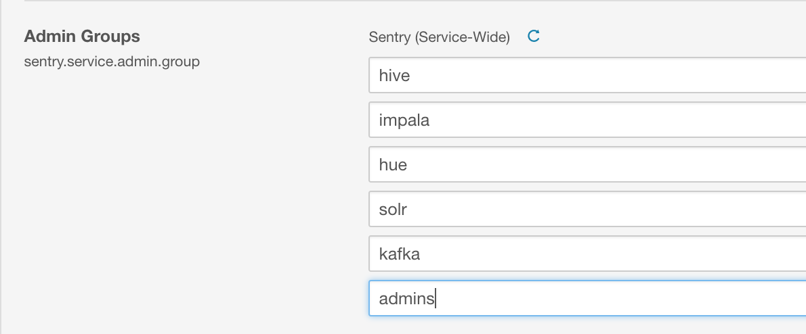

# Title of my document

This is a sample markup document. This can be used with Git and markup language to document assets stored in Git. For example, click <a href="http://cloudera.com">here</a> to visit our website!

You may also show code using this:

```
export DC="dc=us-west-2,dc=compute,dc=internal"
export DOMAIN="us-west-2.compute.internal"
export LDAP=ldap.fqdn.com

echo ${DC} ${DOMAIN} ${LDAP}
```

Or embed images using this:



Or link to repo asset folders using this:

<li>Configure <a href="sssd">sssd</a></li>
<li>Install <a href="tls">certificates</a></li>

Enjoy!
